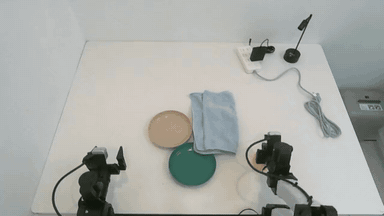
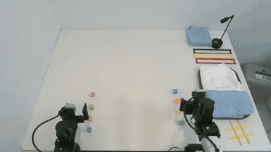
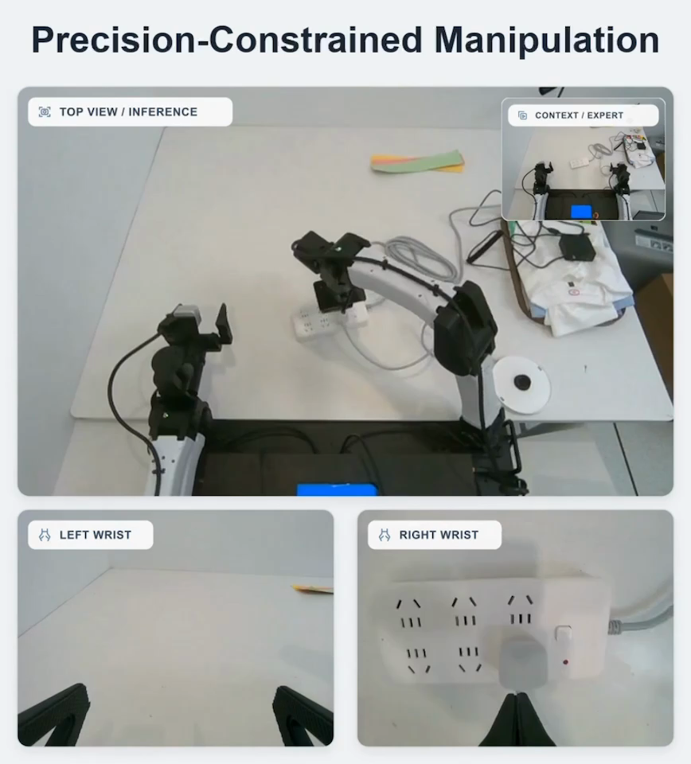
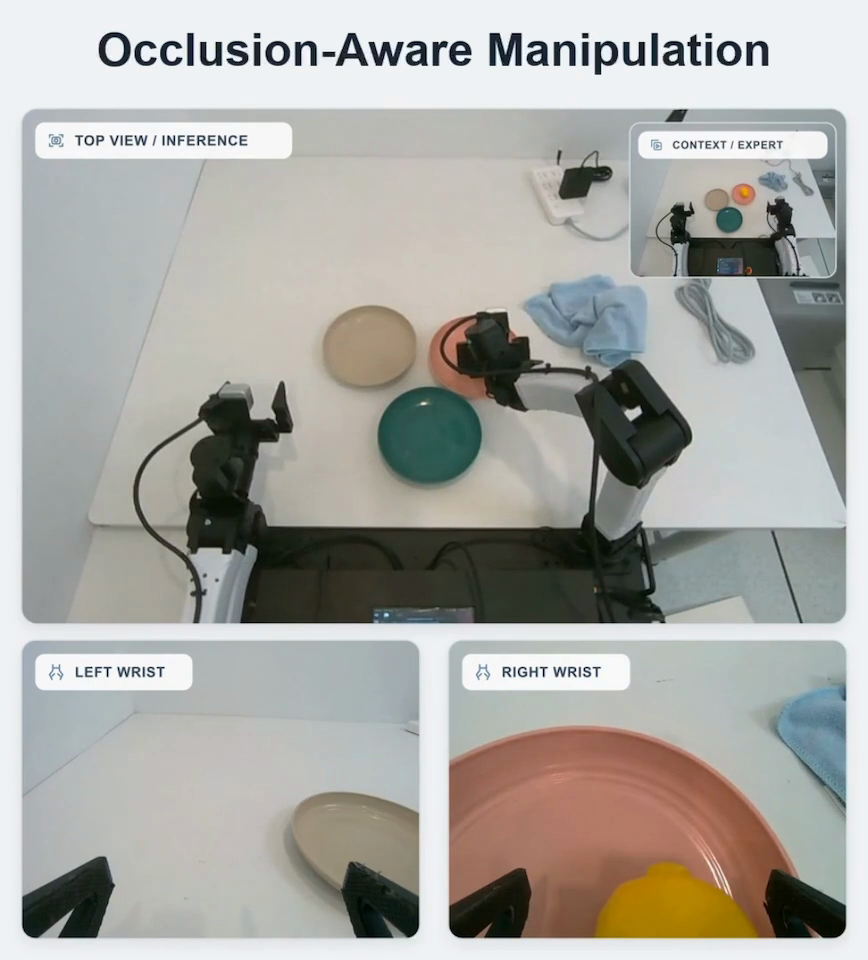
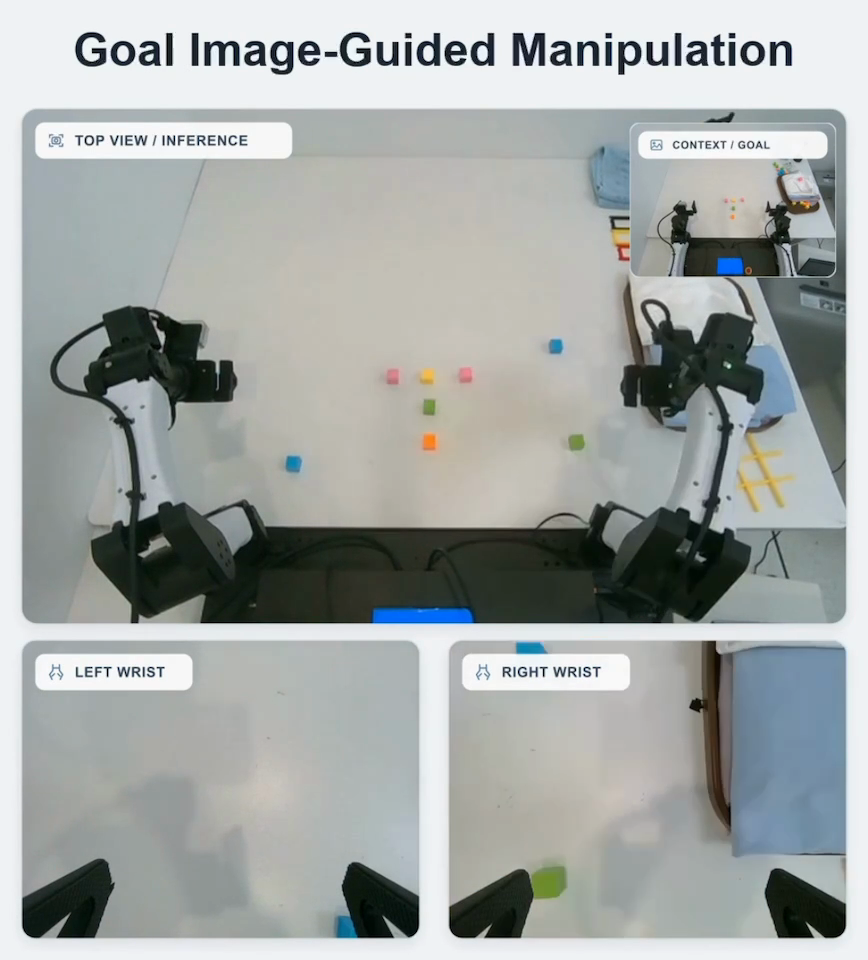

<div align="center">

# GPT-Policy-Eval

**One-Shot Video Demonstration → 单次视频示范，驱动真实机器人**

<sub>研究预览 · 真实机器人演示</sub>

[English](README.md) · **简体中文**

</div>

我们使用 **GPT-6 Astra**，让真实机器人参考**一段视频示范**，结合实时视觉反馈执行任务。

<table align="center">
  <tr>
    <td align="center" valign="middle" width="240" height="80"><strong>无需 VLA</strong></td>
    <td align="center" valign="middle" width="240" height="80"><strong>无需 WAM</strong></td>
  </tr>
  <tr>
    <td align="center" valign="middle" width="240" height="80"><strong>无需 RL</strong></td>
    <td align="center" valign="middle" width="240" height="80"><strong>无需 DAgger</strong></td>
  </tr>
</table>

## 插插排 · 单次视频示范

参考单次视频示范，机器人抓取插头、对齐插孔、插入并松爪，在接触过程中持续调整。

<p align="center">
  <a href="https://github.com/cheng-haha/GPT-Policy-Eval/raw/refs/heads/main/assets/plug-insertion-top-and-right-wrist.mp4">
    
  </a>
  <br>
  <sub>左：顶部视角 · 右：右臂腕部视角 · 12 倍速 · <a href="https://github.com/cheng-haha/GPT-Policy-Eval/raw/refs/heads/main/assets/plug-insertion-top-and-right-wrist.mp4">下载 MP4 ↗</a></sub>
</p>

## 更多演示

<table>
  <tr>
    <td width="50%" valign="top">
      <h3>找到被遮住的目标</h3>
      <a href="https://github.com/cheng-haha/GPT-Policy-Eval/raw/refs/heads/main/assets/hidden-goal.mp4"></a>
      <p>移开毛巾、露出盘子、放入柠檬。一段视频示范，为机器人提供任务上下文。</p>
      <sub>单次视频示范 · 8 倍速 · <a href="https://github.com/cheng-haha/GPT-Policy-Eval/raw/refs/heads/main/assets/hidden-goal.mp4">下载 MP4 ↗</a></sub>
    </td>
    <td width="50%" valign="top">
      <h3>把图片变成现实</h3>
      <a href="https://github.com/cheng-haha/GPT-Policy-Eval/raw/refs/heads/main/assets/visual-goal.mp4"></a>
      <p>参考目标照片，将五块彩色积木摆成 T 形，并在操作中调整摆放位置。</p>
      <sub>目标图片提示 · 24 倍速 · <a href="https://github.com/cheng-haha/GPT-Policy-Eval/raw/refs/heads/main/assets/visual-goal.mp4">下载 MP4 ↗</a></sub>
    </td>
  </tr>
</table>

<sub>以上为选取的单次试验，视频已加速展示。更广泛的评测仍在进行中。</sub>

## 关键瞬间

<table>
  <tr>
    <td width="33%" align="center" valign="top">
      <a href="assets/plug-insertion-keyframe.png"></a>
      <strong>插入插头</strong>
    </td>
    <td width="33%" align="center" valign="top">
      <a href="assets/hidden-goal-keyframe.png"></a>
      <strong>移开遮挡，放入柠檬</strong>
    </td>
    <td width="33%" align="center" valign="top">
      <a href="assets/visual-goal-keyframe.png"></a>
      <strong>按图摆放</strong>
    </td>
  </tr>
</table>

<sub>截图取自演示合集，点击图片可放大查看。</sub>

## 我们接下来做什么

- **开放代码** — 整理并开放演示与评测代码，附使用示例。
- **拓展任务** — 更多接触操作与长程任务。
- **系统评测** — 重复试验、更多模型，以及不同形式的视觉上下文。

## 引用

```bibtex
@misc{chenghaha2026gptpolicyeval,
  author = {{cheng-haha}},
  year   = {2026},
  url    = {https://github.com/cheng-haha/GPT-Policy-Eval}
}
```
