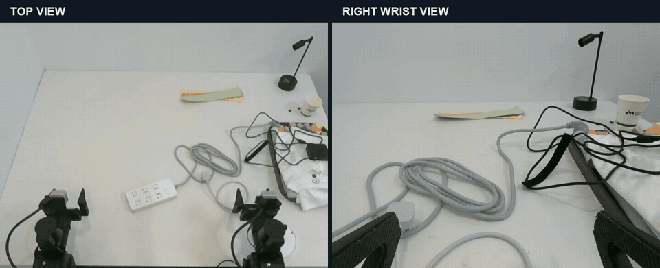

<div align="center">

# GPT-Policy

**One-Shot Video Demonstration → 单次视频示范，驱动真实机器人**

<sub>研究预览 · 真实机器人演示</sub>

[English](README.md) · **简体中文**

</div>

我们使用 **GPT-6 Astra**，让真实机器人参考**一段视频示范**，结合实时视觉反馈执行任务。

**无需 VLA，无需 WAM。**

**无需 RL，无需 DAgger。**

## 插插排 · 单次视频示范

参考单次视频示范，机器人抓取插头、对齐插孔、插入并松爪，在接触过程中持续调整。

<p align="center">
  <a href="https://github.com/cheng-haha/GPT-Policy-Report/raw/refs/heads/main/assets/plug-insertion.mp4">
    
  </a>
  <br>
  <sub>顶部视角 + 右臂腕部视角 · 12 倍速 · <a href="https://github.com/cheng-haha/GPT-Policy-Report/raw/refs/heads/main/assets/plug-insertion.mp4">下载 MP4 ↗</a></sub>
</p>

## 更多演示

<table>
  <tr>
    <td width="50%" valign="top">
      <h3>找到被遮住的目标</h3>
      <a href="https://github.com/cheng-haha/GPT-Policy-Report/raw/refs/heads/main/assets/hidden-goal.mp4"></a>
      <p>移开毛巾、露出盘子、放入柠檬。一段视频示范，为机器人提供任务上下文。</p>
      <sub>单次视频示范 · 8 倍速 · <a href="https://github.com/cheng-haha/GPT-Policy-Report/raw/refs/heads/main/assets/hidden-goal.mp4">下载 MP4 ↗</a></sub>
    </td>
    <td width="50%" valign="top">
      <h3>把图片变成现实</h3>
      <a href="https://github.com/cheng-haha/GPT-Policy-Report/raw/refs/heads/main/assets/visual-goal.mp4"></a>
      <p>参考目标照片，将五块彩色积木摆成 T 形，并在操作中调整摆放位置。</p>
      <sub>目标图片提示 · 24 倍速 · <a href="https://github.com/cheng-haha/GPT-Policy-Report/raw/refs/heads/main/assets/visual-goal.mp4">下载 MP4 ↗</a></sub>
    </td>
  </tr>
</table>

<sub>以上为选取的单次试验，视频已加速展示。更广泛的评测仍在进行中。</sub>

## 后续计划

- **拓展任务** — 更多接触操作与长程任务。
- **系统评测** — 重复试验、更多模型，以及不同形式的视觉上下文。
- **公开报告** — 分享结果、失败案例，以及对机器人上下文学习的观察。

## 引用

```bibtex
@misc{chenghaha2026gptpolicy,
  author = {{cheng-haha}},
  title  = {{GPT-Policy}: One-Shot Video Demonstration for Real-World Robot Execution},
  year   = {2026},
  url    = {https://github.com/cheng-haha/GPT-Policy-Report}
}
```
